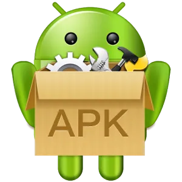

# HeritageDapp

This is a Web3 app to deliver your important stuff (data/assets) to your heirs without human intervention after you die.

    
    
    
    

## Q/A

### What are the important stuff?

1.  Your important text data, messages, passwords etc. These are saved in our servers and delivered to the email addresses that you register on the app.

    - How it works?

      - Before you upload the data, you encrypt the data with a secret key of your choice. You must give this key to the owners of the email addresses you register otherwise they wont be able to decrypt it.
      - If we dont receive any ping from your installed app for more than 30 days, we send your heirs an email with a code and a link to the Heritage app. They download the Heritage app and run it under Inheritor mode. Once they confirm their identity with their email address and the code, we render your encrypted data on the app. Then they use the secret key you gave them to decrypt and read this data.

    - How secure is it?

      - After you encrypt your the data and send to us we encrypt it again before saving in the database. This is to protect your data against database breaches.

2.  Your digital assets which you save in the smart contract.

    - How it works?
      - You register your Ethereum address to the Inheritage smart contract.
      - You deposit the amount that you want your heirs to receive into the smart contract.
      - You register your inheritors and their percentage share of how much you want them to receive from your assets.

## How to install

### Android

1. From Google Play (in progress..)

2. Click below image to download the .apk file for Android

You need to allow Unkown Sources to install the app.

#### For Android 8.x & higher

- From a Home screen, swipe up or down from the center of the display to access the apps screen.
- Navigate: Settings Settings iconApps.
- Tap Menu icon (upper-right).
- Tap Special access.
- Tap Install unknown apps.
- Select the unknown app then tap the Allow from this source switch to turn on.

#### For Android 7.x & lower

- From a Home screen, navigate to Settings.
- Tap Lock screen and security.
- If unavailable, tap Security.
- Tap the Unknown sources switch to turn on or off.
- If unavailable, Unknown sources to turn on or off. Enabled when check mark is present.
- To continue, review prompt then tap OK.

### iOS

iOS users;

1. Must download tracking app from the App Store (in progress..)
2. Visit [Heritage Web dApp](damdafayton.github.io/heritageapp/) to create their authorization token to be used in the iOS app.
